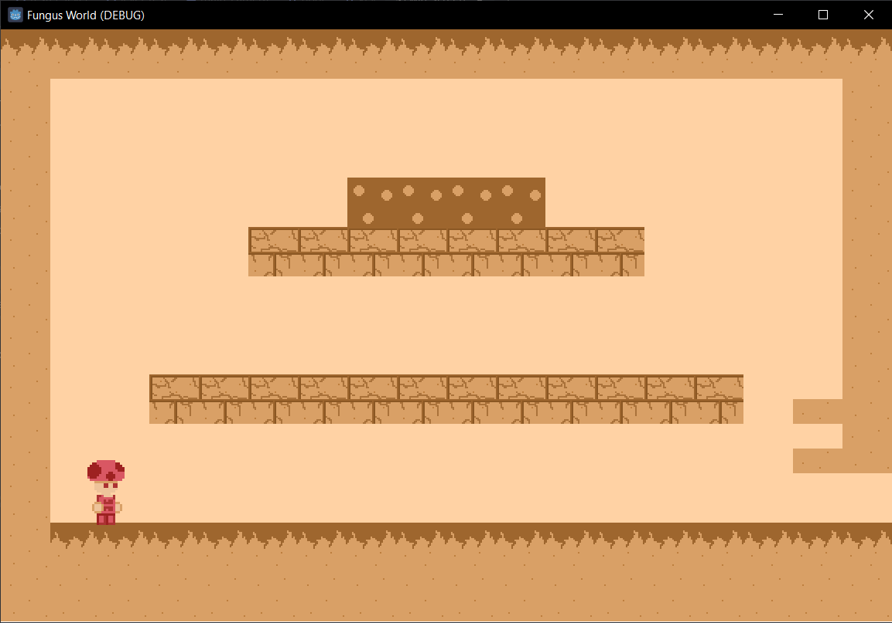
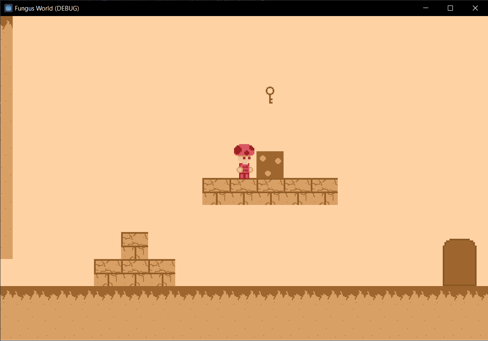

# Fungus World




## Descripción

**Fungus World** es un juego de plataformas en 2D con estética de **hongos** en pixel art. En este juego, los jugadores se embarcan en una aventura a través de niveles llenos de obstáculos, mecánicas únicas y secretos escondidos. A medida que avanzan, los jugadores aprenderán nuevas habilidades y se enfrentarán a retos más complejos.

## Características principales

- **Estilo visual:** Pixel art simple pero colorido, con una temática de hongos y ambientes naturales.
- **Mecánicas de juego:**
  - Caminar, saltar y agacharse.
  - Mecánicas únicas en cada nivel (disparos, cambios de tamaño, plataformas móviles, etc.).
- **Niveles:** 12 niveles, cada uno dividido en 4 subniveles:
  - **Nivel 1:** Tutorial sin mecánicas especiales.
  - **Nivel 2-12:** Cada nivel introduce una nueva mecánica que se explora en los primeros 3 subniveles y culmina en un reto en el último.

## Mecánicas del juego

1. **Caminar y saltar:** Las acciones básicas para navegar el mundo.
2. **Agacharse:** Para moverse por espacios pequeños.
3. **Mecánicas adicionales:**
   - Redimensionar objetos.
   - Disparar para romper cajas.
   - Deslizarse por debajo de obstáculos.
   - Escalar paredes.
   - Volar con una nave.

## Instalación

1. Clona este repositorio:
   ```bash
   git clone https://github.com/Sander20Dev/fungus-world.git
   ```
