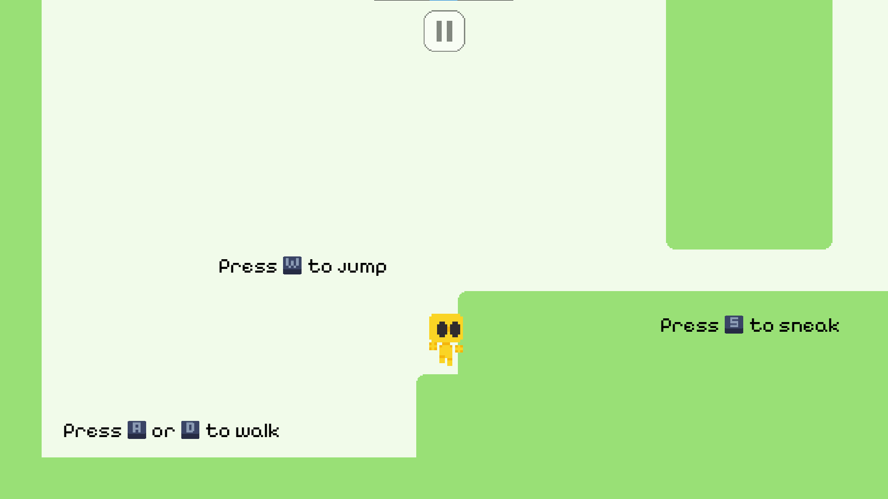
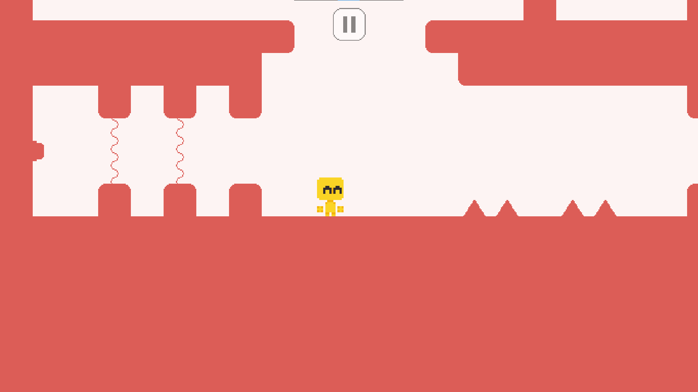
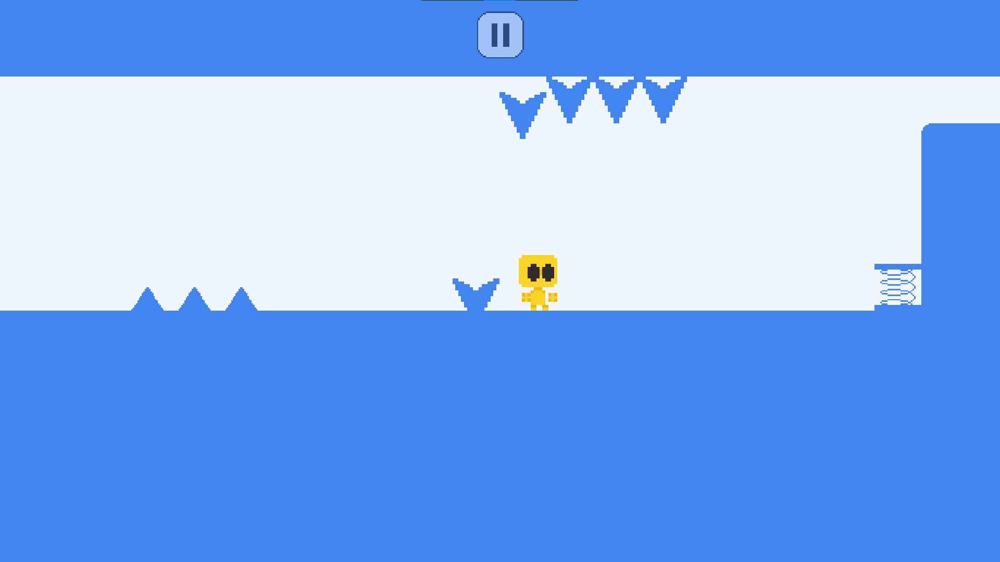
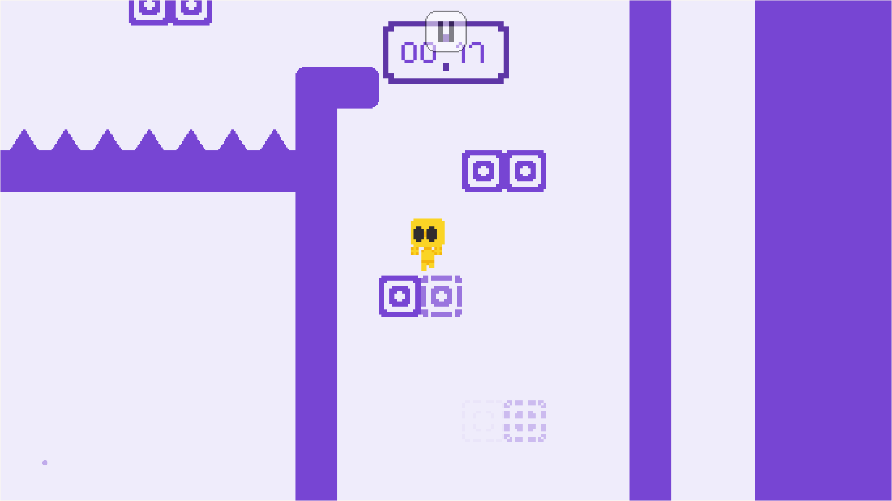

<div align="center">
  <a href="https://github.com/Sander20Dev/fungus-world/">
	  
  </a>
  <h3 align="center">FUNGUS_WORLD</h3>
</div>

[](https://github.com/Sander20Dev/fungus-world/blob/main/LICENSE)
[](https://godotengine.org/)
[](https://sander20dev.itch.io/fungus-world)

## Screenshots






---

Welcome to our **FUNGUS_WORLD**, where your goal is to complete a series of levels, each filled with unique challenges and mechanics. The game currently features **12 levels**, spread across **4 different worlds**. Each world introduces new mechanics while reusing previous ones to create a progressively more challenging experience.

## Game Overview

- **Genre**: Platformer
- **Style**: Simple, minimalist design with pixel art aesthetics
- **Current Levels**: 16 (4 worlds, each consisting of 4 levels)

## Worlds and Mechanics

Each world in the game consists of 4 levels, and every world has its own theme and unique mechanics. While new challenges are introduced in each world, mechanics from previous worlds are reused, keeping gameplay fresh and engaging.

Here’s a breakdown of the current worlds:

### World 1: Tutorial

- **Learn basic moves**: Walking, crouching, and jumping.
- A beginner-friendly introduction to core movement mechanics.

### World 2: Passage of Death

- **Dangerous hazards**: Avoid spikes and lasers.
- Precision and timing are key to surviving this perilous world.

### World 3: Up, Down, Left, Right

- **Complex platforming**: Moving platforms, springs, doors, and falling spikes.
- Master directional challenges and navigate tricky platform combinations.

### World 4: Against Time

- **Time-based challenges**: Timed levels, breakable blocks, timed buttons, and teleporters.
- Race against the clock and carefully manage timed mechanics to succeed.

## Future Plans

Our goal is to expand the game to include **12 worlds**, each with 4 levels, totaling 48 levels. Each new world will introduce additional mechanics and surprises to keep the gameplay experience evolving.

## Visual Style

The game is designed with a **simple, minimalist pixel art** style, focusing on clean visuals that complement the platforming mechanics.

## How to Play

1. Open the game in your browser from [itch.io](https://sander20dev.itch.io/fungus-world).
2. Enjoy the game!

---

## Project Installation

1. Clone the repository to your local machine.

   ```bash
   git clone https://github.com/Sander20Dev/fungus-world.git
   ```

2. Open the project in your preferred Godot editor. We recommend using Godot 4 or newer.
3. Run the game in your editor.

# License

This project is licensed under the MIT License. See the [LICENSE](LICENSE) file for details.
